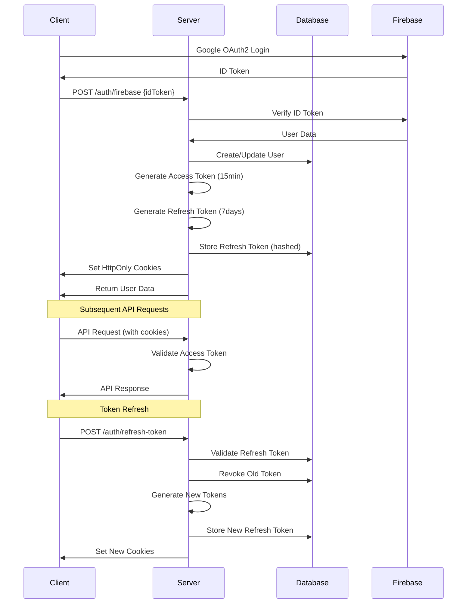

# Secure Cookie Authentication Implementation Guide

## Table of Contents
1. [Overview](#overview)
2. [Architecture](#architecture)
3. [Implementation Details](#implementation-details)
4. [Security Features](#security-features)
5. [API Endpoints](#api-endpoints)
6. [Configuration](#configuration)
7. [Database Schema](#database-schema)
8. [Frontend Integration](#frontend-integration)
9. [Testing](#testing)
10. [Deployment](#deployment)
11. [Troubleshooting](#troubleshooting)
12. [Best Practices](#best-practices)

## Overview

This implementation extends your existing Google OAuth2 authentication system with a production-ready secure authentication mechanism using JWT tokens and HttpOnly cookies. The system follows enterprise-grade security practices and implements token rotation for enhanced security.

### Key Benefits
- **Enhanced Security**: HttpOnly cookies prevent XSS attacks
- **CSRF Protection**: SameSite cookies and CSRF tokens
- **Token Rotation**: Refresh tokens are rotated on each use
- **Device Tracking**: IP and device information for security monitoring
- **Automatic Cleanup**: Expired tokens are automatically removed
- **Rate Limiting**: Maximum tokens per user to prevent abuse

## Architecture

### Dual-Token System
```
┌─────────────────┐    ┌─────────────────┐
│   Access Token  │    │  Refresh Token  │
│   (15 minutes)  │    │   (7 days)      │
│                 │    │                 │
│ - User info     │    │ - Minimal claims│
│ - Roles         │    │ - Stored in DB  │
│ - Hotel ID      │    │ - Hashed        │
└─────────────────┘    └─────────────────┘
         │                       │
         ▼                       ▼
┌─────────────────┐    ┌─────────────────┐
│ HttpOnly Cookie │    │ HttpOnly Cookie │
│ Path: "/"       │    │ Path: "/refresh" │
│ Secure: true    │    │ Secure: true    │
│ SameSite: Strict│    │ SameSite: Strict│
└─────────────────┘    └─────────────────┘
```

### Authentication Flow


## Implementation Details

### 1. RefreshToken Entity

**File**: `src/main/java/com/yakrooms/be/model/entity/RefreshToken.java`

```java
@Entity
@Table(name = "refresh_tokens", 
       indexes = {
           @Index(name = "idx_refresh_token_hash", columnList = "tokenHash"),
           @Index(name = "idx_refresh_token_user", columnList = "userId"),
           @Index(name = "idx_refresh_token_expires", columnList = "expiresAt")
       })
public class RefreshToken {
    @Id
    @GeneratedValue(strategy = GenerationType.IDENTITY)
    private Long id;
    
    @Column(name = "token_hash", nullable = false, unique = true, length = 255)
    private String tokenHash;        // SHA-256 hash of the token
    
    @Column(name = "user_id", nullable = false)
    private Long userId;
    
    @Column(name = "expires_at", nullable = false)
    private LocalDateTime expiresAt;
    
    @Column(name = "is_revoked", nullable = false)
    private Boolean isRevoked = false;
    
    @Column(name = "revoked_at")
    private LocalDateTime revokedAt;
    
    @Column(name = "device_info", length = 500)
    private String deviceInfo;       // User-Agent for tracking
    
    @Column(name = "ip_address", length = 45)
    private String ipAddress;        // Client IP for security
    
    @CreationTimestamp
    @Column(name = "created_at", nullable = false, updatable = false)
    private LocalDateTime createdAt;
    
    @UpdateTimestamp
    @Column(name = "updated_at", nullable = false)
    private LocalDateTime updatedAt;
    
    // Business methods
    public boolean isExpired() {
        return LocalDateTime.now().isAfter(expiresAt);
    }
    
    public boolean isValid() {
        return !isExpired() && !isRevoked;
    }
    
    public void revoke() {
        this.isRevoked = true;
        this.revokedAt = LocalDateTime.now();
    }
}
```

**Security Features**:
- Tokens are hashed before storage (never store plain tokens)
- Automatic expiration cleanup via database constraints
- Audit fields for security monitoring
- Indexed queries for fast lookups

### 2. Enhanced JWT Utilities

**File**: `src/main/java/com/yakrooms/be/security/JwtUtil.java`

```java
@Component
public class JwtUtil {
    // Configuration-driven token expiration
    private final String jwtSecret;
    private final long accessTokenExpirationMs;  // 15 minutes
    private final long refreshTokenExpirationMs; // 7 days
    
    // Token types
    public static final String TOKEN_TYPE_ACCESS = "access";
    public static final String TOKEN_TYPE_REFRESH = "refresh";
    
    // Token generation with proper claims
    public String generateAccessToken(User user) {
        return generateToken(user, TOKEN_TYPE_ACCESS, accessTokenExpirationMs);
    }
    
    public String generateRefreshToken(User user) {
        return generateToken(user, TOKEN_TYPE_REFRESH, refreshTokenExpirationMs);
    }
    
    // Token validation with type checking
    public boolean validateAccessToken(String token) {
        return validateToken(token) && TOKEN_TYPE_ACCESS.equals(extractTokenType(token));
    }
    
    public boolean validateRefreshToken(String token) {
        return validateToken(token) && TOKEN_TYPE_REFRESH.equals(extractTokenType(token));
    }
    
    // Secure token hashing for storage
    public String generateTokenHash(String token) {
        // SHA-256 hashing implementation
    }
}
```

**Security Features**:
- Configurable expiration times via properties
- Token type validation (access vs refresh)
- Secure HMAC-SHA512 signing
- SHA-256 hashing for refresh token storage

### 3. Cookie Management

**File**: `src/main/java/com/yakrooms/be/util/CookieUtil.java`

```java
@Component
public class CookieUtil {
    public static final String ACCESS_TOKEN_COOKIE = "access_token";
    public static final String REFRESH_TOKEN_COOKIE = "refresh_token";
    
    // Secure cookie creation
    public void setAccessTokenCookie(HttpServletResponse response, String token, int maxAgeSeconds) {
        Cookie cookie = createSecureCookie(ACCESS_TOKEN_COOKIE, token, maxAgeSeconds);
        cookie.setPath("/");
        response.addCookie(cookie);
    }
    
    public void setRefreshTokenCookie(HttpServletResponse response, String token, int maxAgeSeconds) {
        Cookie cookie = createSecureCookie(REFRESH_TOKEN_COOKIE, token, maxAgeSeconds);
        cookie.setPath("/refresh-token");
        response.addCookie(cookie);
    }
    
    private Cookie createSecureCookie(String name, String value, int maxAgeSeconds) {
        Cookie cookie = new Cookie(name, value);
        cookie.setHttpOnly(true);     // Prevent XSS attacks
        cookie.setSecure(secureCookies); // HTTPS only in production
        cookie.setMaxAge(maxAgeSeconds);
        return cookie;
    }
}
```

**Security Features**:
- HttpOnly cookies prevent XSS attacks
- Secure flag ensures HTTPS-only transmission
- Proper path settings (access: "/", refresh: "/refresh-token")
- Automatic expiration handling

### 4. Refresh Token Service

**File**: `src/main/java/com/yakrooms/be/service/impl/RefreshTokenServiceImpl.java`

```java
@Service
@Transactional
public class RefreshTokenServiceImpl implements RefreshTokenService {
    
    @Override
    public RefreshToken createRefreshToken(User user, String deviceInfo, String ipAddress) {
        // Check rate limiting
        long activeTokenCount = getActiveTokenCount(user.getId());
        if (activeTokenCount >= maxTokensPerUser) {
            revokeOldestTokens(user.getId(), (int) (activeTokenCount - maxTokensPerUser + 1));
        }
        
        // Generate and hash token
        String token = jwtUtil.generateRefreshToken(user);
        String tokenHash = jwtUtil.generateTokenHash(token);
        
        // Create and save token
        RefreshToken refreshToken = new RefreshToken();
        refreshToken.setTokenHash(tokenHash);
        refreshToken.setUserId(user.getId());
        refreshToken.setExpiresAt(LocalDateTime.now().plusDays(7));
        refreshToken.setDeviceInfo(deviceInfo);
        refreshToken.setIpAddress(ipAddress);
        
        return refreshTokenRepository.save(refreshToken);
    }
    
    @Override
    public RefreshToken validateAndRotateToken(String token, String deviceInfo, String ipAddress) {
        // Validate JWT token
        if (!jwtUtil.validateRefreshToken(token)) {
            throw new SecurityException("Invalid refresh token");
        }
        
        // Find and validate token in database
        String tokenHash = jwtUtil.generateTokenHash(token);
        Optional<RefreshToken> tokenOpt = refreshTokenRepository.findByTokenHashAndNotRevoked(tokenHash);
        
        if (tokenOpt.isEmpty() || tokenOpt.get().isExpired()) {
            throw new SecurityException("Refresh token not found or expired");
        }
        
        // Revoke old token and create new one (token rotation)
        RefreshToken existingToken = tokenOpt.get();
        existingToken.revoke();
        refreshTokenRepository.save(existingToken);
        
        return createRefreshToken(user, deviceInfo, ipAddress);
    }
}
```

**Security Features**:
- Token rotation on each refresh
- Rate limiting based on active token count
- Device and IP tracking for security monitoring
- Automatic cleanup of expired tokens

## Security Features

### 1. Token Security
- ✅ **Short-lived access tokens** (15 minutes)
- ✅ **Long-lived refresh tokens** (7 days)
- ✅ **Token rotation** on refresh
- ✅ **Secure token hashing** before storage
- ✅ **Token type validation**

### 2. Cookie Security
- ✅ **HttpOnly cookies** prevent XSS
- ✅ **Secure flag** for HTTPS-only transmission
- ✅ **SameSite=Strict** prevents CSRF
- ✅ **Proper path restrictions**
- ✅ **Automatic expiration**

### 3. CSRF Protection
- ✅ **CSRF tokens** for state-changing operations
- ✅ **SameSite cookie** attribute
- ✅ **Proper CORS** configuration

### 4. Security Monitoring
- ✅ **Device information** tracking
- ✅ **IP address** logging
- ✅ **Token usage** monitoring
- ✅ **Automatic cleanup** of expired tokens

### 5. Rate Limiting
- ✅ **Maximum tokens per user** (5)
- ✅ **Automatic cleanup** of oldest tokens
- ✅ **Batch cleanup** operations

## API Endpoints

### Authentication Endpoints

#### 1. Google OAuth Login
```http
POST /auth/firebase
Content-Type: application/json

{
  "idToken": "google-firebase-id-token"
}
```

**Response**:
```json
{
  "token": "access-token",
  "user": {
    "id": 1,
    "email": "user@example.com",
    "name": "John Doe",
    "roles": ["GUEST"]
  }
}
```

**Cookies Set**:
- `access_token`: Access token (15 minutes, path: "/")
- `refresh_token`: Refresh token (7 days, path: "/refresh-token")

#### 2. Token Refresh
```http
POST /auth/refresh-token
Cookie: refresh_token=refresh-token-value
```

**Response**:
```json
{
  "message": "Token refreshed successfully",
  "accessTokenExpiresIn": 900,
  "refreshTokenExpiresIn": 604800
}
```

**Cookies Updated**:
- New `access_token` and `refresh_token` cookies

#### 3. Logout
```http
POST /auth/logout
Cookie: access_token=access-token-value; refresh_token=refresh-token-value
```

**Response**:
```json
{
  "message": "Logged out successfully",
  "revokedTokens": 3
}
```

**Cookies Cleared**:
- All authentication cookies are removed

## Configuration

### Application Properties

**File**: `src/main/resources/application.properties`

```properties
# ================== JWT SECURITY CONFIGURATION ==================
# JWT token settings
jwt.secret=${JWT_SECRET:default-secret-key-change-in-production}
jwt.access-token-expiration=900000          # 15 minutes
jwt.refresh-token-expiration=604800000     # 7 days
jwt.refresh-token.max-per-user=5          # Rate limiting
jwt.refresh-token.cleanup-batch-size=100  # Cleanup batch size

# ================== COOKIE SECURITY CONFIGURATION ==================
# Secure cookie settings
app.cookies.secure=${COOKIE_SECURE:true}   # HTTPS-only in production
app.cookies.domain=${COOKIE_DOMAIN:}       # Domain restriction
```

### Environment Variables

**Development**:
```bash
export JWT_SECRET="development-secret-key"
export COOKIE_SECURE="false"
export COOKIE_DOMAIN=""
```

**Production**:
```bash
export JWT_SECRET="your-super-secure-jwt-secret-key-here"
export COOKIE_SECURE="true"
export COOKIE_DOMAIN="yourdomain.com"
```

## Database Schema

### Refresh Tokens Table

```sql
CREATE TABLE refresh_tokens (
    id BIGINT AUTO_INCREMENT PRIMARY KEY,
    token_hash VARCHAR(255) NOT NULL UNIQUE,
    user_id BIGINT NOT NULL,
    expires_at DATETIME NOT NULL,
    is_revoked BOOLEAN NOT NULL DEFAULT FALSE,
    revoked_at DATETIME,
    device_info VARCHAR(500),
    ip_address VARCHAR(45),
    created_at DATETIME NOT NULL,
    updated_at DATETIME NOT NULL,
    
    INDEX idx_refresh_token_hash (token_hash),
    INDEX idx_refresh_token_user (user_id),
    INDEX idx_refresh_token_expires (expires_at),
    
    FOREIGN KEY (user_id) REFERENCES users(id) ON DELETE CASCADE
);
```

### Migration Script

```sql
-- Create refresh_tokens table
CREATE TABLE IF NOT EXISTS refresh_tokens (
    id BIGINT AUTO_INCREMENT PRIMARY KEY,
    token_hash VARCHAR(255) NOT NULL UNIQUE,
    user_id BIGINT NOT NULL,
    expires_at DATETIME NOT NULL,
    is_revoked BOOLEAN NOT NULL DEFAULT FALSE,
    revoked_at DATETIME,
    device_info VARCHAR(500),
    ip_address VARCHAR(45),
    created_at DATETIME NOT NULL DEFAULT CURRENT_TIMESTAMP,
    updated_at DATETIME NOT NULL DEFAULT CURRENT_TIMESTAMP ON UPDATE CURRENT_TIMESTAMP,
    
    INDEX idx_refresh_token_hash (token_hash),
    INDEX idx_refresh_token_user (user_id),
    INDEX idx_refresh_token_expires (expires_at)
);

-- Cleanup expired tokens (run periodically)
DELETE FROM refresh_tokens WHERE expires_at < NOW();
```

## Frontend Integration

### 1. Enable Cookie Support

**Axios Configuration**:
```javascript
// axios-config.js
import axios from 'axios';

const api = axios.create({
  baseURL: 'http://localhost:8080',
  withCredentials: true, // Enable cookie support
  headers: {
    'Content-Type': 'application/json',
  },
});

export default api;
```

**Fetch Configuration**:
```javascript
// fetch-config.js
const apiCall = async (url, options = {}) => {
  const response = await fetch(`http://localhost:8080${url}`, {
    ...options,
    credentials: 'include', // Enable cookie support
    headers: {
      'Content-Type': 'application/json',
      ...options.headers,
    },
  });
  
  return response.json();
};
```

### 2. Authentication Service

```javascript
// auth-service.js
class AuthService {
  async login(googleIdToken) {
    const response = await api.post('/auth/firebase', {
      idToken: googleIdToken
    });
    
    // Cookies are automatically set by the browser
    return response.data;
  }
  
  async refreshToken() {
    try {
      const response = await api.post('/auth/refresh-token');
      return response.data;
    } catch (error) {
      // Handle refresh failure
      this.logout();
      throw error;
    }
  }
  
  async logout() {
    try {
      await api.post('/auth/logout');
    } finally {
      // Clear any local state
      localStorage.removeItem('user');
    }
  }
  
  // Automatic token refresh interceptor
  setupTokenRefresh() {
    api.interceptors.response.use(
      (response) => response,
      async (error) => {
        if (error.response?.status === 401) {
          try {
            await this.refreshToken();
            // Retry original request
            return api.request(error.config);
          } catch (refreshError) {
            this.logout();
            window.location.href = '/login';
          }
        }
        return Promise.reject(error);
      }
    );
  }
}

export default new AuthService();
```

### 3. React Integration Example

```javascript
// AuthContext.jsx
import React, { createContext, useContext, useEffect, useState } from 'react';
import AuthService from './auth-service';

const AuthContext = createContext();

export const AuthProvider = ({ children }) => {
  const [user, setUser] = useState(null);
  const [loading, setLoading] = useState(true);

  useEffect(() => {
    // Setup automatic token refresh
    AuthService.setupTokenRefresh();
    
    // Check if user is already authenticated
    checkAuthStatus();
  }, []);

  const checkAuthStatus = async () => {
    try {
      // Make a request to a protected endpoint
      const response = await api.get('/api/user/profile');
      setUser(response.data);
    } catch (error) {
      setUser(null);
    } finally {
      setLoading(false);
    }
  };

  const login = async (googleIdToken) => {
    try {
      const response = await AuthService.login(googleIdToken);
      setUser(response.user);
      return response;
    } catch (error) {
      throw error;
    }
  };

  const logout = async () => {
    await AuthService.logout();
    setUser(null);
  };

  return (
    <AuthContext.Provider value={{
      user,
      loading,
      login,
      logout,
      isAuthenticated: !!user
    }}>
      {children}
    </AuthContext.Provider>
  );
};

export const useAuth = () => {
  const context = useContext(AuthContext);
  if (!context) {
    throw new Error('useAuth must be used within an AuthProvider');
  }
  return context;
};
```

## Testing

### 1. Automated Test Script

**File**: `test-secure-auth.sh`

```bash
#!/bin/bash
# Test script for Secure Cookie Authentication

BASE_URL="http://localhost:8080"
GOOGLE_ID_TOKEN="your-google-id-token-here"

echo "🔐 Testing Secure Cookie Authentication System"

# Test 1: Health Check
echo "Test 1: Health Check"
response=$(curl -s "$BASE_URL/health")
if [[ $response == *"UP"* ]]; then
    echo "✅ Health check passed"
else
    echo "❌ Health check failed"
fi

# Test 2: Google OAuth Login
if [ "$GOOGLE_ID_TOKEN" != "your-google-id-token-here" ]; then
    echo "Test 2: Google OAuth Login"
    login_data="{\"idToken\": \"$GOOGLE_ID_TOKEN\"}"
    response=$(curl -s -X POST -H "Content-Type: application/json" \
                    -c cookies.txt -d "$login_data" \
                    "$BASE_URL/auth/firebase")
    
    if [[ $response == *"token"* ]]; then
        echo "✅ Login successful"
        
        # Test 3: Token Refresh
        echo "Test 3: Token Refresh"
        refresh_response=$(curl -s -X POST -b cookies.txt \
                            "$BASE_URL/auth/refresh-token")
        
        if [[ $refresh_response == *"successfully"* ]]; then
            echo "✅ Token refresh successful"
        else
            echo "❌ Token refresh failed"
        fi
        
        # Test 4: Logout
        echo "Test 4: Logout"
        logout_response=$(curl -s -X POST -b cookies.txt \
                          "$BASE_URL/auth/logout")
        
        if [[ $logout_response == *"successfully"* ]]; then
            echo "✅ Logout successful"
        else
            echo "❌ Logout failed"
        fi
    else
        echo "❌ Login failed"
    fi
fi

# Cleanup
rm -f cookies.txt
echo "🎉 Test Complete!"
```

### 2. Manual Testing

```bash
# 1. Test login
curl -X POST http://localhost:8080/auth/firebase \
  -H "Content-Type: application/json" \
  -d '{"idToken":"your-google-token"}' \
  -c cookies.txt

# 2. Test protected endpoint
curl -X GET http://localhost:8080/api/user/profile \
  -b cookies.txt

# 3. Test token refresh
curl -X POST http://localhost:8080/auth/refresh-token \
  -b cookies.txt

# 4. Test logout
curl -X POST http://localhost:8080/auth/logout \
  -b cookies.txt
```

### 3. Unit Tests

```java
// JwtUtilTest.java
@ExtendWith(MockitoExtension.class)
class JwtUtilTest {
    
    @Test
    void testGenerateAccessToken() {
        User user = createTestUser();
        String token = jwtUtil.generateAccessToken(user);
        
        assertNotNull(token);
        assertTrue(jwtUtil.validateAccessToken(token));
        assertEquals("access", jwtUtil.extractTokenType(token));
    }
    
    @Test
    void testGenerateRefreshToken() {
        User user = createTestUser();
        String token = jwtUtil.generateRefreshToken(user);
        
        assertNotNull(token);
        assertTrue(jwtUtil.validateRefreshToken(token));
        assertEquals("refresh", jwtUtil.extractTokenType(token));
    }
    
    @Test
    void testTokenExpiration() {
        User user = createTestUser();
        String token = jwtUtil.generateAccessToken(user);
        
        // Wait for token to expire (in test, use shorter expiration)
        Thread.sleep(1000);
        
        assertFalse(jwtUtil.validateAccessToken(token));
    }
}
```

## Deployment

### 1. Environment Setup

**Docker Environment Variables**:
```dockerfile
# Dockerfile
ENV JWT_SECRET=your-super-secure-jwt-secret-key-here
ENV COOKIE_SECURE=true
ENV COOKIE_DOMAIN=yourdomain.com
```

**Docker Compose**:
```yaml
# docker-compose.yml
version: '3.8'
services:
  app:
    build: .
    environment:
      - JWT_SECRET=${JWT_SECRET}
      - COOKIE_SECURE=true
      - COOKIE_DOMAIN=${COOKIE_DOMAIN}
    ports:
      - "8080:8080"
```

### 2. Production Checklist

- [ ] Set strong JWT secret (minimum 256 bits)
- [ ] Enable HTTPS (COOKIE_SECURE=true)
- [ ] Set proper cookie domain
- [ ] Configure database indexes
- [ ] Set up monitoring and logging
- [ ] Configure rate limiting
- [ ] Set up token cleanup job
- [ ] Test authentication flow
- [ ] Verify security headers
- [ ] Monitor token usage patterns

### 3. Monitoring

**Key Metrics to Monitor**:
- Active token count per user
- Token refresh frequency
- Failed authentication attempts
- Token cleanup operations
- Device/IP patterns

**Logging Configuration**:
```properties
# Log authentication events
logging.level.com.yakrooms.be.security=INFO
logging.level.com.yakrooms.be.service.RefreshTokenService=INFO

# Log security events
logging.pattern.console=%d{yyyy-MM-dd HH:mm:ss} [%thread] %-5level %logger{36} - %msg%n
```

## Troubleshooting

### Common Issues

#### 1. Cookies Not Being Set
**Problem**: Cookies are not being set in the browser
**Solution**: 
- Check `withCredentials: true` in frontend requests
- Verify CORS configuration allows credentials
- Check cookie domain and path settings

#### 2. Token Refresh Failing
**Problem**: Token refresh returns 401
**Solution**:
- Check refresh token expiration
- Verify token hash in database
- Check device/IP tracking

#### 3. CSRF Token Issues
**Problem**: CSRF token validation failing
**Solution**:
- Verify CSRF token repository configuration
- Check SameSite cookie settings
- Ensure proper CORS configuration

#### 4. Database Connection Issues
**Problem**: Refresh token operations failing
**Solution**:
- Check database connection pool
- Verify table indexes
- Check transaction configuration

### Debug Commands

```bash
# Check cookie settings
curl -I http://localhost:8080/auth/firebase

# Test token validation
curl -X POST http://localhost:8080/auth/refresh-token \
  -H "Cookie: refresh_token=your-token" \
  -v

# Check database
mysql -u root -p -e "SELECT * FROM refresh_tokens LIMIT 5;"
```

## Best Practices

### 1. Security
- Use strong JWT secrets (minimum 256 bits)
- Enable HTTPS in production
- Set proper cookie domains
- Monitor authentication patterns
- Regular security audits

### 2. Performance
- Use database indexes for token lookups
- Implement connection pooling
- Batch cleanup operations
- Monitor token usage patterns

### 3. Maintenance
- Regular token cleanup
- Monitor active token counts
- Update security configurations
- Review authentication logs

### 4. Development
- Use different secrets for each environment
- Test authentication flows thoroughly
- Implement proper error handling
- Use structured logging

---

## Conclusion

This secure cookie authentication implementation provides enterprise-grade security for your Spring Boot application. It maintains backward compatibility while adding robust security features including token rotation, device tracking, and comprehensive monitoring.

The system is production-ready and follows industry best practices for authentication security. Regular monitoring and maintenance will ensure continued security and performance.

For questions or issues, refer to the troubleshooting section or consult the comprehensive documentation provided.
